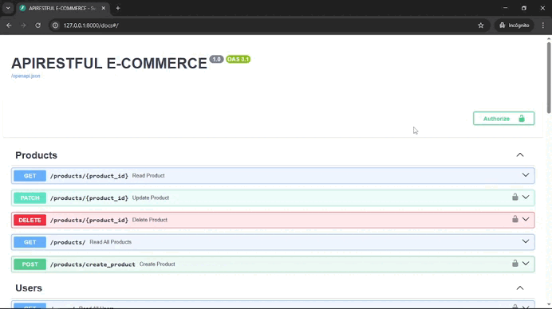
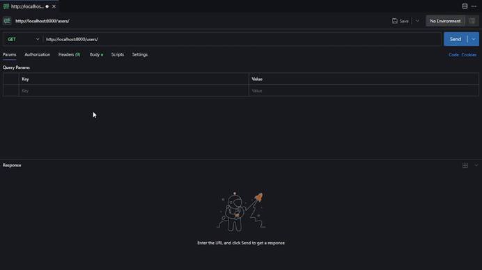

# API RESTful para E-Commerce

  

     




---

## Overview
This project is a robust and scalable RESTful API designed for an E-Commerce platform. Built with **FastAPI** and **SQLAlchemy** in a fully asynchronous environment, it provides a solid foundation for managing products, users, orders, and authentication. It leverages **Redis** for high-performance caching to reduce latency and database load. The entire stack is fully containerized with a production-optimized Docker setup, ensuring a simple and consistent deployment across any environment.

---

## Features

*   **Asynchronous Architecture:** High performance and concurrency thanks to FastAPI and `asyncpg`.
*   **High-Performance Caching:** Integrates **Redis** to reduce database load and significantly decrease response times for frequent queries.
*   **Secure JWT Authentication:** Implements `access tokens` and `refresh tokens` for secure and flexible session management.
*   **Role-Based Authorization:** Protected endpoints that distinguish between users (`user`) and administrators (`admin`), ensuring that only authorized personnel can perform critical operations.
*   **Full Product Management (CRUD):** Endpoints to create, read, update, and delete products, with restricted access for administrators.
*   **Full User Management (CRUD):** Allows new user registration and complete management by administrators.
*   **Order Management:** Authenticated users can create orders from available products. The system automatically validates stock, calculates the total price, and updates inventory upon order creation. Users can also view their order history.
*   **Database Migrations:** Integration with **Alembic** to version and manage the database schema safely.
*   **Fully Containerized:** A ready-to-use `docker-compose.yml` configuration to launch the application and database with a single command.
*   **Comprehensive Test Suite:** Unit and integration tests with **Pytest** and **HTTPX** to ensure code reliability.
*   **Automated Code Quality:** **pre-commit** configuration to run `detect-secrets` and other linters before each commit.

---

## Technologies Used

### Core Development
* **Programming Language:** Python 3.12+
* **Backend Framework:** FastAPI, Gunicorn (with Uvicorn workers)
* **HTTP Client:** httpx

### Data Management
* **Database:** PostgreSQL
* **Object-Relational Mapper (ORM):** SQLAlchemy (with `asyncio` support)
* **Migrations:** Alembic

### Configuration & Security
* **Authentication:** PyJWT, passlib, bcrypt
* **Data Validation:** Pydantic
* **Environment Variables:** **python-dotenv**

### Development & DevOps Workflow
* **Testing:** Pytest, pytest-asyncio, HTTPX
* **Code Quality:** pre-commit, detect-secrets
* **Containerization:** Docker, Docker Compose
* **Version Control:** Git, GitHub
* **CI/CD:** GitHub Actions
* **Deployment:** Render

### Supporting Tools
* **API Documentation:** Swagger UI (automatically generated by FastAPI)
* **Development Tools:** VSCode, Postman
* **Operating System:** Cross-platform (Windows, macOS, Linux)

---

## Project Structure

The project follows a modular and organized structure to enhance maintainability and scalability.

```bash
apirestful-ecommerce/
├── .github/                   # Configuration for GitHub Actions (CI/CD)
│   └── workflows/
│       └── ci.yml
├── alembic/                   # Alembic scripts and configuration for migrations
├── assets/                    # Static assets (e.g., images, fonts, gifs)
├── performance_tests/         # Performance testing scripts    
├── redis/                     # Redis configuration
│   └── redis.conf
├── scripts/                   # Utility scripts (e.g., create superuser)
├── src/                       # Main source code directory
│   ├── auth/                  # Authentication logic and security dependencies
│   ├── cache/                 # Caching logic and Redis client setup
│   ├── core/                  # Core configuration and custom exceptions
│   ├── data_base/             # DB session setup and base classes
│   ├── models/                # SQLAlchemy models (DB tables)
│   ├── routers/               # API endpoints (controllers)
│   ├── schemas/               # Pydantic schemas (data validation)
│   ├── services/              # Business logic
│   └── main.py                # FastAPI application entry point
├── tests/                     # Automated tests
├── .dockerignore              # Files to be ignored by Docker
├── .env.example               # Template for environment variables
├── .gitignore                 # Files to be ignored by Git
├── .pre-commit-config.yaml    # Configuration for pre-commit hooks
├── alembic.ini                # Alembic configuration file
├── docker-compose.yml         # Container orchestration
├── Dockerfile                 # Application image definition
├── entrypoint.sh              # Container entrypoint script
├── LICENSE
├── pytest.ini                 # Pytest configuration file
├── README.md                  
├── requirements.txt           # Production dependencies
└── requirements-dev.txt       # Development dependencies
```


---

## Prerequisites

Before you begin, please ensure you have the following tools installed and configured on your local machine.

*   **Git:** You'll need Git to clone the repository. You can download it from [git-scm.com](https://git-scm.com/downloads).
*   **Python 3.12+:** The application is built with Python 3.12. You can download it from the [official Python website](https://www.python.org/downloads/).
*   **Docker & Docker Compose:** The project is fully containerized. You will need Docker to build and run the services. Docker Desktop for Windows and Mac includes Docker Compose.
    *   [Install Docker Desktop](https://www.docker.com/products/docker-desktop/) (recommended for Mac/Windows).
    *   [Install Docker Engine](https://docs.docker.com/engine/install/) and [Docker Compose](https://docs.docker.com/compose/install/) for Linux.
*  **(Optional) Postman:** A tool for testing APIs. You can download it from [postman.com](https://www.postman.com/downloads/).

---
   
## Installation and Setup

Follow these steps to set up and run the project in your local environment.

1.  **Clone the repository:**
    ```bash
    git clone https://github.com/david-switalski/apirestful-ecommerce.git
    cd apirestful-ecommerce
    ```

2.  **Create and activate a virtual environment (recommended):**
    *   **Create the environment:**
        ```bash
        python -m venv venv
        ```
    *   **Activate the environment:**
        *   On Windows:
            ```bash
            .\venv\Scripts\activate
            ```
        *   On macOS/Linux:
            ```bash
            source venv/bin/activate
            ```

3.  **Install the dependencies:**
    With your virtual environment activated, install all necessary dependencies (including development ones).
    ```bash
    pip install -r requirements-dev.txt
    ```

4.  **Set up Git Hooks (pre-commit):**
    This step is crucial for maintaining code quality. It installs the Git hooks defined in `.pre-commit-config.yaml`.
    ```bash
    pre-commit install
    ```
    Now, `detect-secrets` and other checks will run automatically before each commit.

5.  **Set up environment variables:**
    Create a `.env` file from the provided example.
    ```bash
    cp .env.example .env
    ```
    Open the `.env` file and fill in all the variables. For `SECRET_KEY`, you can generate a secure key with:
    ```bash
    python -c "import secrets; print(secrets.token_hex(32))"
    ```

6.  **Start the services with Docker Compose (Recommended Method):**
    This process involves two main steps: first building the Docker image with your latest code, and then starting the containers.

    *   **Step 1: Build the Image**
        This command builds the `web` service's Docker image based on the Dockerfile. It's best to run this whenever you make changes to your code or dependencies.
        ```bash
        docker-compose build
        ```

    *   **Step 2: Start the Services**
        Once the image is built, this command starts the API and database containers.
        ```bash
        docker-compose up
        ```
    The API will be available at `http://localhost:8000`. You will see the application logs directly in your terminal. Press `CTRL+C` to stop the services.

    *   **Tip: Running in the Background**

        To run the services in the background and free up your terminal, use the "-d" (detached) flag:
        ```bash
        docker-compose up -d
        ```

    *   **Stopping the Services**

        To stop and remove the containers cleanly, run:
        ```bash
        docker-compose down
        ```

---

## How to Use the API

The easiest way to explore and test the API is through the interactive documentation.
### Interactive Documentation

FastAPI automatically generates an interactive documentation. You can access it at:

- **Swagger UI:** [http://localhost:8000/docs](http://localhost:8000/docs)
- **ReDoc:** [http://localhost:8000/redoc](http://localhost:8000/redoc)

---
### Authentication Flow

While you can authenticate directly within the Swagger UI, the following GIF uses **Postman** to demonstrate the raw HTTP flow for obtaining and using a JWT token. This is how a real-world application would interact with the API.



**The flow consists of these steps:**

- Sending a **`POST`** request with user credentials to the `/users/token` endpoint.
- Receiving an **`access_token`** in the response.
- Using this token in the **`Authorization: Bearer <token>`** header for all subsequent requests to protected endpoints.

---

### Order Creation Flow

Authenticated users can create orders for one or more products. The API handles all the necessary business logic.

**The flow is as follows:**

1.  **Authentication:** The user must first authenticate (as shown in the flow above) to obtain a valid `access_token`.
2.  **Create Order:** The user sends a `POST` request to the `/orders/` endpoint with the access token in the `Authorization` header.
3.  **Request Body:** The body of the request must contain a list of items, where each item specifies a `product_id` and the desired `quantity`.
    ```json
    {
      "items": [
        {
          "product_id": 1,
          "quantity": 2
        },
        {
          "product_id": 5,
          "quantity": 1
        }
      ]
    }
    ```
4.  **Backend Logic:** The API performs several checks:
    *   Verifies that all products exist.
    *   Ensures each product is marked as `available`.
    *   Checks if there is sufficient `stock` for the requested quantity.
5.  **Database Transaction:** If all checks pass, the API:
    *   Calculates the `total_price` based on the products' current prices.
    *   Creates a new `Order` and associated `OrderItem` records in the database.
    *   Decrements the `stock` for each product purchased.
6.  **Response:** The user receives a `201 Created` response containing the full details of the newly created order.

Users can also retrieve their order history via the `GET /orders/` and `GET /orders/{order_id}` endpoints.

---

### Creating a Superuser
*   #### For Local Development
    To create a superuser while working on your local machine, open a new terminal with the containers running and run:
    ```bash
    docker-compose exec web python -m scripts.create_super_user
    ```
    This will create a user with the default credentials defined in the script.

*   #### In Production (Render)
    The superuser creation process is **fully automated**. On every deployment, the `entrypoint.sh` script runs `scripts/create_super_user.py`. This script will create an admin user if one does not already exist, using the credentials defined in the `ADMIN_USER` and `ADMIN_PASSWORD` environment variables.

---

### Database Management
The project uses Alembic for migrations. To create a new migration after modifying the models in `src/models/`:
```bash
docker-compose exec web alembic revision --autogenerate -m "Migration message"
```
To apply the migrations:
```bash
docker-compose exec web alembic upgrade head
```

---

## Running Tests

The test suite runs against an isolated, temporary database that is created and destroyed automatically for each test session. This guarantees that your development data is never affected and that tests are always run in a clean, predictable environment.

**Prerequisite:** The Docker database container must be running.

1.  **Start the database service only:**
    If you don't have the full application running, you can start just the database container in the background:
    ```bash
    docker-compose up -d db
    ```
    This ensures that `pytest` has a PostgreSQL server to connect to at `localhost:5432`.

2.  **Run Pytest:**
    Make sure your virtual environment is activated and the dependencies are installed. Then, from the project root, run:
    ```bash
    pytest
    ```
    `pytest` will connect to the running database, create a temporary `test_...` database, run all tests, and delete it upon completion.

---

### **Deployment**

This API has been deployed to the cloud and is fully operational.

*   **Platform:** Render
*   **Live API URL:** [https://apirestful-ecommerce.onrender.com](https://apirestful-ecommerce.onrender.com)
*   **Interactive Documentation:** [https://apirestful-ecommerce.onrender.com/docs](https://apirestful-ecommerce.onrender.com/docs)

The deployment strategy is containerized using a production-optimized Docker image. On every startup, the container's `entrypoint.sh` script prepares the environment by automatically running database migrations and creating the superuser before launching the **Gunicorn** server. This ensures the application starts in a consistent and correct state with a production-ready web server.

---

## Contact

**David Switalski**
*(Informático y Desarrollador en Formación)*

* **LinkedIn:** [David Switalski](https://www.linkedin.com/in/david-switalski-50b11133a/)
* **GitHub:** [David Switalski](https://github.com/david-switalski)
* **Email:** davidspuni@gmail.com

---

## Contribution

Contributions are welcome! Please feel free to submit a pull request or open an issue to discuss potential changes or additions.